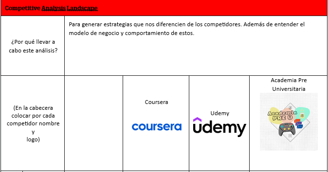
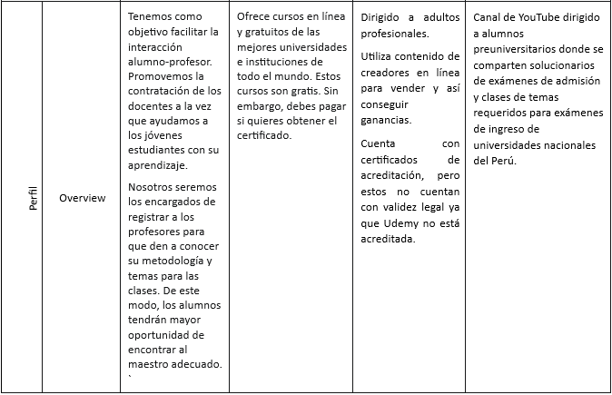
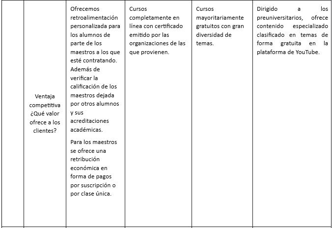
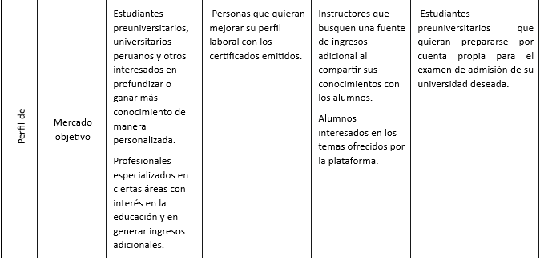
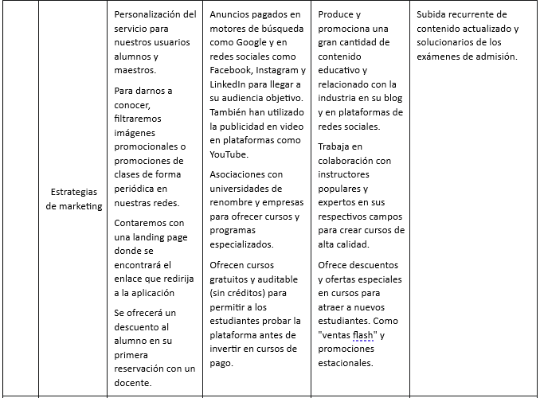
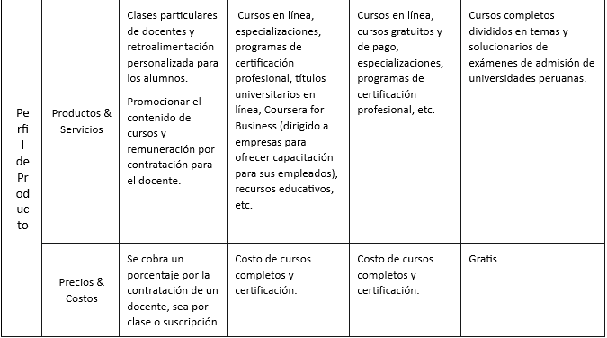
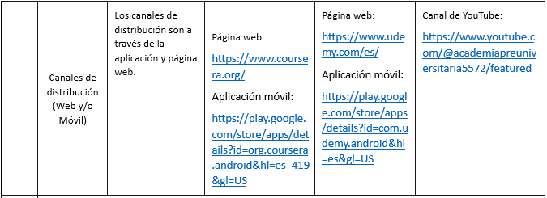
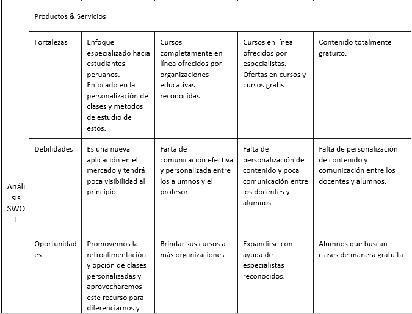
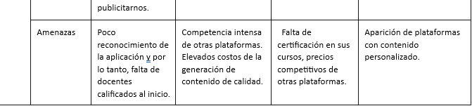

# Capítulo 1 - Introducción
### 1.1.	Startup Profile
#### 1.1.1. Descripción de la Startup
Somos Tutor'sMe, un startup fundado por un grupo de estudiantes de la Universidad Peruana de Ciencias Aplicadas (UPC). Nuestra misión es ofrecer oportunidades laborales a profesionales que están en búsqueda de una posición adecuada. A través de nuestra plataforma, conectamos a los profesores con las mejores ofertas educativas que se adapten a sus preferencias y habilidades, facilitando así su búsqueda de empleo de manera eficiente y efectiva.
##### **Misión:**
La misión de Tutor'sMe es contribuir a combatir el desempleo en el país, conectando a profesores desempleados con oportunidades laborales acordes a sus capacidades y preferencias de trabajo.
##### **Visión:**
La visión de Tutor'sMe es expandirse a nivel internacional, con el objetivo de llegar a más personas que necesiten empleo, al mismo tiempo que asistimos a las empresas en la búsqueda del talento adecuado según sus requisitos.
##### **Valores:**
- Responsabilidad social
- Valor por el aprendizaje
- Orientación al cliente
- Transparencia
- Diferencia
- Pasión
#### 1.1.2. Perfil de los integrantes 

-
-
-
-
- **Alessandro Vega Paico - U201910225 **
Mi nombre es Alessandro Vega, actualmente estoy estudiando la carrera de ingeniería de software. Soy una persona perseverante en lo que hago y me gusta aprender cosas nuevas. A lo largo de la carrera, he adquirido conocimientos en C++, HTML, MatLab, como tambien en Angular y Vue; y tengo como meta aumentar mis conocimientos en diferentes lenguajes de programación.

### 1.2. Solution  Profile

Nuestro proyecto  tiene como objetivo facilitar la interacción alumno-profesor. De esta forma, estaremos promoviendo la creación de empleo en el país al dar una plataforma a los docentes a la vez que ayudaremos a los jóvenes estudiantes con sus estudios. Nosotros seremos los encargados de registrar a los profesores para que den a conocer su metodología y temas para las clases. De este modo, los alumnos tendrán mayor oportunidad de encontrar al maestro adecuado. `
#### 1.2.1. Antecedentes y Problemática

Los antecedentes son esenciales para mantener un contexto claro de las soluciones previamente propuestas, lo que nos permite utilizarlos como puntos de referencia para mejorar y reconocer las limitaciones que puedan haber surgido.

**Classgap**

Classgap es una plataforma en línea gratuita que brinda a los profesores la oportunidad de ofrecer clases particulares a estudiantes de primaria, secundaria, bachillerato e incluso cursos universitarios. Su enfoque se basa en un principio sencillo pero efectivo. Los profesores que se registran en Classgap pueden establecer sus propias tarifas y recibir respuestas de los estudiantes en función de sus servicios, anuncios, habilidades y competencias.

**SmartAcademy**

SmartAcademy es una plataforma de educación en línea que ofrece clases a través de videoconferencia. Los estudiantes y profesores solo necesitan un dispositivo con cámara web y acceso a Internet para iniciar las clases. La oferta académica se divide en dos ramas principales: educación no superior, que abarca desde primaria hasta bachillerato, pruebas de acceso a ciclos formativos superiores y acceso a la universidad, y educación superior, que incluye cursos para estudiantes de grados de ingeniería.

**Tutellus**

Tutellus se destaca como una de las plataformas de aprendizaje colaborativo más grandes en el mundo de habla hispana. Su funcionamiento se diferencia un poco de las demás páginas mencionadas previamente. En lugar de enfocarse en clases particulares presenciales o sesiones en vivo a través de webcam, Tutellus invita a los profesores a grabar sus cursos y cargarlos en la plataforma. Esto ha permitido a algunos profesores construir una marca personal y aumentar la difusión de sus cursos, alcanzando así a un público más amplio.

#### 1.2.2. Lean UX Process
##### 1.2.2.1. Lean UX Problem Statements
Tutor'sMe es un proyecto destinado a abordar desafíos educativos en Perú. Tanto los profesores que buscan ofrecer sus conocimientos como los estudiantes en busca de oportunidades de aprendizaje se enfrentan a una problemática común. La falta de una plataforma eficiente para conectar a ambas partes limita el acceso a clases de alta calidad a precios asequibles. Esto se debe en gran parte a la falta de competencia y a la ausencia de un sistema claro para encontrar profesores calificados. Los estudiantes tienen dificultades para identificar y elegir a los profesores adecuados para sus necesidades educativas, mientras que los profesores luchan por promocionar sus habilidades y encontrar estudiantes interesados. Esta situación plantea un desafío significativo, ya que limita la capacidad de los estudiantes para acceder a una educación de calidad y dificulta a los profesores encontrar oportunidades para compartir su conocimiento. Nuestro proyecto se centra en la creación de una plataforma que aborde la problemática de la falta de acceso a clases de calidad y la dificultad para encontrar oportunidades de enseñanza en Perú, lo que beneficiará tanto a los estudiantes como a los profesores y contribuirá al desarrollo educativo y profesional en el país.

**Problem Statement 1:** Acceso Limitado a Clases de Calidad
En el entorno actual, los estudiantes en Perú enfrentan dificultades para acceder a clases de alta calidad a precios asequibles. La falta de una plataforma eficiente para conectar a profesores calificados limita sus opciones educativas y restringe su desarrollo de habilidades. 

**Problem Statement 2:** Dificultad para Encontrar Profesores Calificados
Los profesores en Perú luchan por promocionar sus habilidades y encontrar estudiantes interesados en sus clases. La falta de una plataforma clara para la búsqueda de profesores dificulta su capacidad para llegar a un público más amplio.

**Problem Statement 3:** Necesidad de una Plataforma Eficiente de Conexión
La falta de una plataforma eficiente para conectar a profesores y estudiantes peruanos impide la creación de oportunidades de enseñanza y aprendizaje efectivas. Esto limita el acceso a una educación de calidad y restringe el crecimiento educativo y profesional en el país.

##### 1.2.2.2 Lean UX Assumptions
Creemos que los clientes necesitan plataforma que facilite la comunicación entre docentes y alumnos, lo cual promoverá la contratación de docentes en la aplicación y ayudará a los estudiantes deseosos de mejorar. La aplicación brindará un organizado servicio de seguimiento de clases, evaluaciones y posibles tareas.
- Estas necesidades se pueden resolver con una plataforma atractiva, que simplifique la gestión de tareas y evaluaciones; Además de que promueva la comunicación entra docentes y alumnos.
- El público objetivo son partícipes del sistema educativo y son personas interesadas en lo académico.
- Los alumnos pueden calificar a los docentes después de ser partícipes de sus clases.
- Nuestra competencia principal son otras aplicaciones que ofrecen cursos en línea y canales educativos de internet.
- Los venceremos gracias al sistema de retroalimentación y seguimiento personalizado de la aplicación.
- El mayor riesgo del producto es la fiabilidad de los docentes partícipes de la aplicación.
- Lo resolveremos con un sistema de registro riguroso que requiera cierto tipo de certificación docente.

Features:
- El sistema de retroalimentación y seguimiento de docentes a alumnos será intuitivo, sencillo y motivador.
- El alumno podrá dejar recomendaciones anónimas al docente para mejorar su servicio.
- El docente podrá compartir recursos académicos relevantes con sus alumnos.
- Los alumnos podrán obtener ofertas por la contratación de un docente por tiempos prolongados (más de 3 meses).
- Los alumnos pueden revisar el perfil del docente para evaluar su recorrido profesional, calificación de sus estudiantes y otras cuentas de redes sociales.
- Los docentes pueden personalizar su perfil con sus logros, campos de estudio y redes sociales.

##### 1.2.2.3 Lean UX Hypothesis Statement
Creemos firmemente que una plataforma capaz de filtrar las mejores oportunidades laborales para nuestros docentes sin empleo, tiene el potencial de reducir significativamente la tasa de desempleo en nuestro país. Esta creencia se basa en la suposición de que la gran mayoría de personas mayores de 18 años poseen dispositivos con acceso a internet, un requisito esencial tanto para utilizar nuestra plataforma como para recibir notificaciones importantes en sus correos electrónicos. Nuestra confianza en esta suposición se fundamenta en datos del INEI (2020), que informan que el 62.9% de los hogares en Lima Metropolitana disponen de acceso a la red.

Mediremos nuestro éxito en función de dos indicadores clave. Primero, consideraremos que hemos tenido un impacto positivo si logramos reducir el tiempo promedio de desempleo a tan solo 1.5 semanas. Segundo, establecemos como un hito importante alcanzar un registro de no menos de 500 usuarios activos en los primeros dos meses de operación de la plataforma. Estos indicadores nos servirán como métricas claras para evaluar el impacto y el alcance de nuestro servicio.
##### 1.2.2.4 Lean UX Canvas

### 1.3. Segmentos objetivo

Definir el segmento objetivo es esencial para dirigir de manera efectiva nuestra plataforma y sus recursos. Permite una personalización precisa de nuestras ofertas, adaptándolas a las necesidades particulares de estos grupos. Por tanto, hemos identificado los siguientes segmentos objetivos:

**Estudiantes Universitarios:** Jóvenes y adultos que están cursando programas de estudios superiores en una amplia variedad de disciplinas académicas. Nuestra plataforma les ofrece la oportunidad de acceder a profesores altamente calificados que les ayudarán a comprender conceptos complejos, prepararse para exámenes y mejorar su desempeño académico en el nivel universitario.

**Estudiantes de Educación Primaria y Secundaria:** Niños y adolescentes que desean fortalecer sus habilidades académicas y alcanzar un rendimiento sobresaliente en sus estudios de primaria y secundaria. Tutor'sMe les brinda la capacidad de encontrar profesores expertos en diversas materias para recibir apoyo educativo adicional y mejorar su desempeño escolar.

Este segmento representa a estudiantes que buscan tanto el éxito académico como el desarrollo de habilidades a lo largo de su educación. Nuestra plataforma está comprometida en servir como un recurso integral para satisfacer sus necesidades educativas, facilitando el acceso a clases de calidad y oportunidades de aprendizaje personalizadas que los impulsen hacia el éxito en sus respectivos niveles educativos.

# Capítulo 2 - Requirement Elicitation and Analysis
## 2.1. Competidores.
En el mercado actual de la educación en línea, existen varias opciones que ofrecen una variedad de cursos y plataformas para estudiantes y profesores. Sin embargo, hemos identificado que muchas de estas opciones carecen de una experiencia personalizada y efectiva para la conexión entre profesores y estudiantes.

**Coursera:** Coursera es una plataforma de educación en línea que ofrece una amplia gama de cursos, programas de certificación y programas de grado en colaboración con universidades e instituciones de renombre a nivel mundial. Los cursos en Coursera cubren una amplia variedad de temas, desde ciencias de la computación hasta humanidades y negocios. La plataforma se centra en ofrecer una educación de alta calidad y brindar a los estudiantes acceso a certificados reconocidos internacionalmente. Coursera se destaca por su asociación con universidades líderes y por la variedad de opciones educativas que ofrece.

**Udemy:** Udemy es una plataforma de educación en línea que permite a los instructores crear y vender cursos en una amplia variedad de temas. Los cursos en Udemy son creados por expertos independientes y pueden incluir desde desarrollo de software hasta arte y música. Udemy se destaca por su amplia gama de cursos disponibles a precios accesibles, lo que la hace atractiva tanto para estudiantes como para instructores que desean compartir su conocimiento. Sin embargo, la calidad del contenido puede variar, ya que cualquiera puede convertirse en instructor en la plataforma.

**Academia Pre Universitaria (Canal de YouTube):** Academia Pre Universitaria es un canal de YouTube diseñado específicamente para estudiantes preuniversitarios. Este canal se dedica a compartir recursos como solucionarios de exámenes de admisión y lecciones relacionadas con los temas necesarios para aprobar los exámenes de ingreso a las universidades nacionales de Perú. Proporciona acceso gratuito a contenido educativo de gran valor para aquellos estudiantes que buscan prepararse para los rigurosos exámenes de admisión universitaria en el país. Sin embargo, es importante destacar que el canal no brinda la oportunidad de interactuar en tiempo real con instructores ni ofrece certificados o credenciales formales de finalización de cursos.

### 2.1.1. Análisis competitivo.

### 2.1.2. Estrategias y tácticas frente a competidores.
## 1)	Excelencia en la Calidad de Datos:
## a) Tácticas:
- Desarrollar e implementar algoritmos avanzados de coincidencia de empleo que utilicen datos de empleos y perfiles de candidatos con una precisión y efectividad excepcionales, con el objetivo de proporcionar resultados altamente relevantes y significativos.
- Mantener un seguimiento constante de la calidad de los datos y realizar mejoras continuas para garantizar que nuestro servicio ofrezca resultados precisos y relevantes de manera constante.
- Realizar procesos rigurosos de limpieza y verificación de datos para asegurar la calidad y confiabilidad de la información almacenada. Esto nos proporcionará una ventaja competitiva al contar con datos precisos y actualizados.

## 2) Excepcional Servicio al Cliente:
## b) Tácticas:
- Establecer un equipo de atención al cliente altamente capacitado y dedicado para ofrecer respuestas rápidas y soluciones efectivas a las consultas y problemas de nuestros usuarios.
- Realizar encuestas periódicas para recopilar opiniones de los usuarios y utilizar esta valiosa retroalimentación para identificar áreas de mejora y oportunidades de innovación en nuestro servicio. Posteriormente, aplicar ajustes y actualizaciones de manera regular para mantener la satisfacción del usuario en constante evolución.

## 3)	Estrategias de Marketing Digital y Promociones Activas
## Tácticas:
- Ejecutar una estrategia de marketing integral que incluya la optimización del sitio web para mejorar su visibilidad en los motores de búsqueda.
- Establecer alianzas estratégicas con comunidades en línea relacionadas con la búsqueda de empleo para promocionar nuestros servicios y alcanzar un público más amplio.
- Ofrecer promociones y descuentos exclusivos para atraer a nuevos usuarios interesados en nuestros servicios.

## 4)	Enfoque en Segmentos de Mercado Específicos
## d) Tácticas:
- Identificar nichos de mercado, como industrias o ubicaciones geográficas, donde exista una alta demanda de búsqueda de empleo. Adaptar nuestro servicio para satisfacer las necesidades específicas de estos nichos.
- Realizar investigaciones de mercado y análisis de la competencia para identificar posibles brechas en el mercado que puedan ser aprovechadas por nuestro startup. Esto nos permitirá ofrecer soluciones más enfocadas y efectivas para cada segmento de mercado identificado

## 2.2. Entrevistas

### 2.2.1. Diseño de entrevistas

#### Profesores:

- ¿Cuál es su nombre, edad?
- ¿Cuál es tu nivel de educación?
- ¿Cuál es tu área de especialización o campo de estudio?
- ¿Tienes experiencia laboral previa en el rubro de educación? En caso afirmativo, ¿cuántos años de experiencia tienes?
- Si la pregunta anterior fue afirmativa ¿En qué tipo de educación tiene experiencia? (particular, inicial, primaria, secundaria, superior)
- ¿Qué tipo de clases estarías buscando impartir? (presencial, semi-presencial, remoto, grabadas)
- ¿Qué cursos te interesaría enseñar? (matemática, lenguaje, idiomas, extracurriculares, etc.)
- ¿Piensas que nuestra plataforma podría ser tu principal fuente de ingresos?
- ¿Qué habilidades o competencias consideras que tienes para destacar frente al resto de maestros en la plataforma?
- ¿Qué consideras que debe tener una profesor en su perfil para hacerlo destacar?
- ¿Qué canales o plataformas utilizas/utilizarías para dictar clases?
- ¿Qué te motiva a ofrecer tus clases en nuestra plataforma?
- ¿Qué dificultades has enfrentado para encontrar nuevos alumnos?
- ¿Qué expectativas tienes sobre una plataforma que facilite encontrar potenciales alumnos?

#### Alumnos:

- ¿Cuál es su nombre y grado educativo?
- ¿Cuántos cursos llevas estudiando actualmente?
- ¿En cuántos de esos cursos consideras que tienes dificultades?
- ¿Qué tipo de profesor crees que sería ideal para ti?
- ¿Crees que la metodología del profesor influye en cuánto puedas aprender?
- ¿Qué cualidades o características valoras más en una clase? (Que sea dinámica, práctica, basada en teoría, etc.)
- ¿Qué recursos utilizas para estudiar o aprender temas nuevos?
- ¿Alguna vez has tomado clases particulares? De ser así, ¿cómo contactabas con los profesores?
- ¿Cuánto estarías dispuesto a pagar por una clase particular de tu tema de preferencia?
- ¿Qué criterios consideras importantes al elegir un profesor?
- ¿Cuál es tu motivación al buscar tomar clases particulares?
- ¿Qué complicaciones encuentras al buscar profesores particulares?
- ¿Qué expectativas tienes sobre una plataforma que provee de contactos para clases particulares?
- ¿Qué características u opciones considerarías necesarias en una plataforma que provee de contactos para clases particulares?
- ¿Qué funcionalidad crees que necesita nuestro programa para retener la actividad de los alumnos en la página?

#### 2.3.1 User Persona
#### 2.3.2 User Task Matrix

| Tarea \ Usuario              | Estudiantes (Frecuencia/Importancia) | Profesores (Frecuencia/Importancia) |
|------------------------------|-------------------------------------|-----------------------------------|
| Registrarse                  | Alta / Alta                         | Baja / Media                      |
| Buscar un Tutor              | Alta / Alta                         | Media / Alta                      |
| Programar Clase              | Alta / Alta                         | Alta / Alta                       |
| Acceder a Materiales         | Alta / Media                        | Media / Alta                      |
| Realizar Pago                | Alta / Baja                         | Baja / Baja                       |
| Calificar al Profesor        | Media / Alta                        | Media / Alta                      |
| Gestionar Perfil             | Media / Alta                        | Alta / Alta                       |
| Comunicarse con el Tutor     | Alta / Alta                         | Alta / Alta                       |
| Buscar Clases por Tema       | Alta / Alta                         | Media / Alta                      |

#### 2.3.3 User Journey Mapping 
#### 2.3.4 Empathy Mapping
#### 2.3.5 As-Is Scenario Mapping

| Fases | Crear cuenta | Buscar profesores en la plataforma | Elegir al profesor ideal |  Publicar anuncios sobre clases |
|--|--|--|--|--|
| Doing | - Ingresar mis datos personales y elegir para qué utilizaré la plataforma | - Selecciono el curso y los temas que deseo llevar | - Reviso el perfil del profesor, analizando su introducción, descripción de las clases y costo por hora | - Elijo los cursos y los temas que deseo dictar. Además, incluyo información sobre dichas clases, como la metodología y el precio por hora|
| Thinking | - Se pregunta si la plataforma le brindará los temas y docentes que necesita | - Se pregunta si encontrará algún profesor que se adapte a sus horarios y temas de estudio | - Se pregunta qué tipo de profesor es el adecuado según su perfil y clases que ofrece | - Se pregunta si habrá usuarios que soliciten sus clases|
| Feeling | - Se siente nervioso porque es su primera vez buscando tutores privados online | - Se siente dudoso sobre si podrá encontrar un tutor que maneje el tema y horario adecuados | - Se siente aliviado al ver la variedad de profesores y metodologías que puede elegir | - Se siente contento porque podrá tener un ingreso extra con un horario flexible|

# Capítulo 3 - Requirements Specification
### 3.1. To-Be Scenario Mapping
### 3.2. User Stories
### 3.3. Impact Mapping
### 3.4. Product Backlog

# Capítulo 4 - Product Design
### 4.1 Style Guidelines
En esta sección se mostrarán los parámetros y estándares que se seguirán en el desarrollo de la aplicación web, evaluando así criterios de diseño y características que tendrá nuestra plataforma.
#### 4.1.1 General Style Guidelines
#### 4.1.2. Web Style Guidelines
### 4.2. Information Architecture
#### 4.2.1. Organization Systems
#### 4.2.2. Labeling Systems
Para las etiquetas de la plataforma utilizamos técnicas que representan el contenido de forma simple y clara. Para ello, definimos las siguientes características:
- Títulos: con un promedio de entre 3 a 4 palabras, debemos mostrar la sección de forma clara para el fácil entendimiento del usuario.
- Frases y slogans: con 15 palabras como máximo, buscamos generar un lazo emocional entre el usuario y nuestra aplicación web.
- Descripciones: con un mínimo de 25 palabras, buscamos dar información más extensa y detallada.
- Clases en la sección "Búsqueda": se debe escribir como mínimo 1 palabra para que recomiende los mejores resultados posibles a la búsqueda.

A su vez, tenemos también las siguientes representaciones comúnes.
- “Sign Up” permitirá crear una cuenta en la plataforma, donde el usuario podrá elegir el uso que le dará a la misma e introducirá su información personal y de contacto.
- “Log In” permitirá el inicio de sesión en la plataforma.
- “Recuperar Contraseña” permitirá recuperar la contraseña existente o cambiarla de ser necesario, a través de un correo electrónico o mensaje de texto como método de verificación.
- “Perfil” incluirá la información registrada del perfil y la opción de modificar dichos datos.

#### 4.2.3 SEO Tags and Meta Tags
#### 4.2.4 Searching Systems
#### 4.2.5. Navigation Systems
### 4.3. Landing Page UI Design
#### 4.3.1. Landing Page Wireframe
[Link del Landing Page Wireframe en Google Fotos](https://photos.app.goo.gl/9Y6EhuH7Qx97d7Q4A)
#### 4.3.2. Landing Page Mock-ups
### 4.4. Web Application UX/UI Design
En esta sección, abordaremos el diseño de experiencia de usuario (UX) y diseño de interfaz de usuario (UI) específicamente adaptados para nuestra aplicación web. Estas disciplinas desempeñan un papel crítico en la creación de una experiencia de usuario efectiva y atractiva. Nuestro enfoque de diseño se centrará en garantizar una experiencia de usuario de alta calidad y coherente en toda la aplicación.

#### 4.4.1. Web Application Wireframe
#### 4.4.2. Web Application Mock-ups
#### 4.4.3. Web Application Flow Diagrams
### 4.5. Web Application Prototyping
### 4.6. Domain-Driven Software Architecture
#### 4.6.1. Software Architecture Context Diagrams
#### 4.6.2. Software Architecture Container Diagrams
#### 4.6.3. Software Architecture Components Diagrams
### 4.7. Software Object-Oriented Design
En esta sección, abordaremos el diseño orientado a objetos de software, que es fundamental para la estructura y arquitectura de nuestra aplicación. El diseño orientado a objetos se basa en los principios de la programación orientada a objetos (POO) y se utilizará para modelar y organizar nuestro software de manera eficiente y modular.

#### 4.7.1. Class Diagrams
#### 4.7.2. Class Dictionary
### 4.8. Database Design
#### 4.8.1. Database Diagram
# Capítulo 5 - Product Implementation, Validation & Deployment
### 5.1. Software Configuration Management
#### 5.1.1. Software Development Environment Configuration
#### 5.1.2. Source Code Management
#### 5.1.3. Source Code Style Guide & Conventions
#### 5.1.4. Software Deployment Configuration
### 5.2. Lading Page, Services & Application Implementations
#### 5.2.X.1. Sprint Planning X
#### 5.2.X.2. Sprint Backlog X
#### 5.2.X.3. Development Evidence for Sprint Review
#### 5.2.X.4. Testing Suite Evidence for Sprint Review
#### 5.2.X.5. Execution Evidence for Sprint Review
#### 5.2.X.6. Services Documentation Evidence for Sprint Review
#### 5.2.X.7. Software Deployment Evidence for Sprint Review
#### 5.2.X.8. Team Collaboration Insights during Sprint
### 5.3. Validation Interviews
#### 5.3.1. Diseño de Entrevistas
#### 5.3.2. Registro de Entrevistas
#### 5.3.3. Evaluación según heurísticas
### 5.4. Video About the Product
